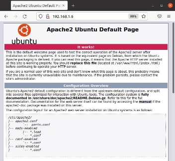
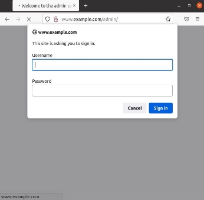
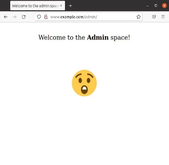
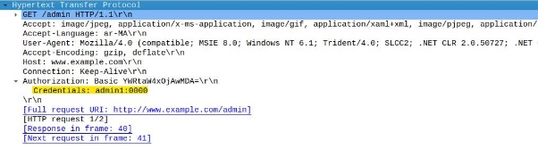
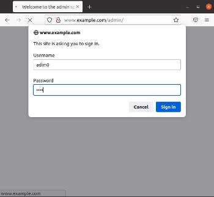

# Apache2-web-server
web server
A Step-by-Step Guide To Set Up Apache2 HTTP Server 


Team Members: 

EL RHAZOUANI Zineb 
ELOBBI Anass 
ERROKHSSY Abdelatti
ERRAAD Adil  
KARTIT Hicham  
YOUSSI Kenza  
SAID EL OUARDI 

Major: **Cyber Security**

**Index:** 

Introduction 

What is Apache Server? Apache2 Server configuration 

- Installing the Apache2 Server 
- Verifying the configuration 
- Setting Up Virtual Hosts 

Setting up Password Authentication 

- Configuring Access Control within the Virtual Host Definition using **htpasswd** tool. 
- Configuring Access Control with **.htaccess** Files using **htdigest** tool. 

Personal Directories Conclusion 

**Introduction:** 

A web server is a computer that runs websites. It's a computer program that distributes web pages as they are requisitioned. The basic objective of the web server is to store, process and deliver web pages to the users. This intercommunication is done using Hypertext Transfer Protocol (HTTP). These web pages are mostly static content that includes HTML documents, images, style sheets, test etc. Apart from HTTP, a web server also supports SMTP (Simple Mail transfer Protocol) and FTP (File Transfer Protocol) protocol for emailing and for file transfer and storage. 

When anyone requests for a website by adding the URL or web address on a web browser’s (like Chrome or Firefox) address bar (like www.example.com), the browser sends a request to the Internet for viewing the corresponding web page for that address. A Domain Name Server (DNS) converts this URL to an IP Address (For example 192.168.216.345), which in turn points to a Web Server. 

All websites on the Internet have a unique identifier in terms of an IP address. These days, Apache server is the most common web server available in the market.  

**What is Apache Server?** 

[Apache ](https://www.sumologic.com/application/apache/)HTTP Server is a free and open-source web server that delivers web content through the internet. It is commonly referred to as Apache and after development, it quickly became the most popular HTTP client on the web (Apache handles almost 70 percent of all websites available today). It’s widely thought that Apache gets its name from its development history and process of improvement through applied patches and modules but that was corrected back in 2000. It was revealed that the name originated from the respect of the Native American tribe for its resiliency and durability. 

The Apache HTTP Server Project is an effort to develop and maintain an open- source HTTP server for modern operating systems including UNIX and Windows. The goal of this project is to provide a secure, efficient and extensible server that provides HTTP services in sync with the current HTTP standards. 

**Apache2 Server configuration** 

- **Installing the Apache2 Server:** 

```bat

sudo apt install apache2 -y

```

- **Verifying the configuration:** 

After the installation process, we should restart the **Apache** Server: 

```bat

sudo systemctl start apache2 
sudo systemctl status apache2

```

The output is: 


The service appears to have started successfully. However, the best way to test this is to request a page from Apache.  

We can access the default Apache landing page to confirm that the software is running properly through our IP address which can be obtained by the following command: 

```bat

hostname -I 

```

After having the IP address (in our case **192.168.1.4**), we should enter it into our browser’s address bar: 

```bat

http://192.168.1.4

```

And we should see the default Apache2 web page: 



On Ubuntu, Apache keeps its main configuration files within the "**/etc/apache2**" folder: 

```bat

cd /etc/apache2  ls -F 

```

It shows all **“apache2”** folder content: 

```bat

apache2.conf  conf-available/  conf-enabled/  envvars   magic mods-available/ mods-enabled/  ports.conf  sites-available/  sites-enabled/ 

```

There are a number of plain text files and some sub-directories in this directory: 

- **apache2.conf:** this is the main configuration file for the server. Almost all configuration can be done from within this file, although it is recommended to use separate, designated files for simplicity. This file will configure defaults and be the central point of access for the server to read configuration details. 
- **Envvars:** this file holds variable definitions such as APACHE\_LOG\_DIR (the location of Apache log files). 
- **ports.conf:** This file is used to specify the ports that virtual hosts should listen on. 
- **conf.d/:** This directory is used for controlling specific aspects of the Apache configuration. 
- **sites-available/:** This directory contains all of the virtual host files that define different web sites. These will establish which content gets served 

for which requests. These are available configurations, not active configurations. 

- **sites-enabled/:** This directory establishes which virtual host definitions are actually being used. Usually, this directory consists of symbolic links to files defined in the **"sites-available"** directory. 
- **mods-[enabled,available]/:** These directories are similar in function to the sites directories, but they define modules that can be optionally loaded instead. 
- **Setting Up Virtual Hosts:** 

When using the Apache web server, we can use virtual hosts to encapsulate configuration details and host more than one domain from a single server. 

Apache has one server block enabled by default that is configured to serve documents from the **“/var/www/html”** directory. While this works well for a single site, it can become unwieldy if you are hosting multiple sites. Instead of modifying **“/var/www/html”**, let’s create a directory structure within **“/var/www”** for our **www.example.com** site, leaving **“/var/www/html”** in place as the default directory to be served if a client request doesn’t match any other sites. 

Now, let’s create the directory for **www.example.com** as follows, using the **-p** flag to create any necessary parent directories: 

```bat

sudo mkdir -p /var/www/www.example.com 

```

Next, assign ownership of the directory with the **$USER** environmental variable (change the directory ownership to current user): 

```bat

sudo chown -R $USER:$USER /var/www/www.example.com 

```

Then, assigning the necessary permissions as follows: 

```bat

sudo chmod -R 755 /var/www/www.example.com

```


After setting up the virtual host and assign necessary permission, we will create a sample page for our website: 

```bat

sudo gedit /var/www/www.example.com/index.html **

```

Then, we will add the following sample HTML: 

```html

	<html> 

		<head> 

			<title>Welcome to www.example.com! </title> 

		</head>

		<body> 

			<br> 

				<p align="center" >
				<font face = "Comic sans MS" size =" 5"align="center">
				Success!  The <b>www.example.com</b>virtual host is working!                    </font>

				</p>

				<p style="font-size:100px" align="center">&#128540;</p> 

		</body>

	</html> 

```

In order for Apache to serve this content, it’s necessary to create a virtual host file with the correct directives. Instead of modifying the default configuration file located at **“/etc/apache2/sites-available/000-default.conf”** directly, let’s make a new one at **/etc/apache2/sites-available/www.example.com.conf**: 

```bat

sudo gedit www.example.com.conf

```

Now, we will add the following configuration: 

```bat

<VirtualHost \*:80>

	ServerAdmin admin@example.com

	ServerName www.example.com

	ServerAlias www.example.com

	DocumentRoot /var/www/www.example.com

	ErrorLog ${APACHE\_LOG\_DIR}/error.log

	CustomLog ${APACHE\_LOG\_DIR}/access.log combined 
</VirtualHost> 

```

Notice that we’ve updated the **DocumentRoot** to our new directory and **ServerAdmin** to an email that the **www.example.com** site administrator can access. We’ve also added two directives: **ServerName**, which establishes the base domain that should match for this virtual host definition, and **ServerAlias**, which defines further names that should match as if they were the base name. 

Let’s enable **www.example.com.conf** the file with the **a2ensite** tool:

```bat

 **sudo a2ensite www.example.com.conf 

```

And disable the default site defined in **000-default.conf**: 

```bat

sudo a2dissite 000-default.conf 

```

Let’s test for configuration errors: 

```bat

sudo apache2ctl configtest

```

And the output should be:** 

**AH00558: apache2: Could not reliably determine the server's fully qualified domain name, using 127.0.1.1. Set the 'ServerName' directive globally to suppress this message **

**Syntax OK** 

Now, we should restart Apache to implement the changes: **sudo systemctl reload apache2 **

Apache should now show the costumed page that we have made (without DNS resolving): 


And if we enable our **DNS** whose **IP:192.168.1.6**, and adding the **www.example.com** record to the **example.com** zone, **Apache** should be serving our domain name:  


|||
| - | - |
**Setting up Password Authentication:** 

In this part we need to have a file with our users (or admins) and passwords in a format that Apache can read, and configure it to check this file before serving our protected content.  

We can do this in two different ways: 

The first option is to edit the Apache configuration and add our password protection to the virtual host file. This will generally give better performance because it avoids the expense of reading distributed configuration files.  

The second option is to use the **htaccess** **files** (or "**distributed configuration files**") which provide a way to make configuration changes on a per-directory basis. In other words, **htaccess file** is a file, containing one or more configuration directives, is placed in a particular document directory, and the directives apply to that directory, and all subdirectories thereof. The disadvantage is that **Apache** has to re-read these files on every request that involves the directory, which can impact performance. 

- **Configuring Access Control within the Virtual Host Definition using htpasswd tool:** 

First, we should create **htpasswd** file with admins authentication information needed to access our restricted content. For that we will use the **htpasswd** utility which is used to create and update the flat-files used to store usernames and password for basic authentication of HTTP users. 

Now we will create a hidden file for this purpose called **.htpasswd** within our **“/etc/apache2”** configuration directory. 

```bat

cd /etc/apache2/ ls -a

```

The (**ls -a**) command will enlist the whole list of the current directory including the hidden files: 

```bat

apache2.conf  conf-enabled/  .htpasswd  mods-available/ ports.conf  sites-enabled/  conf-available/  envvars magic   mods-enabled/  sites-available/ 

```

The first time we use this utility, we need to add the **-c** option to create the specified file. We specify a username (**admin0** in this example) at the end of the command to create a new entry within the file: 


```bat

sudo htpasswd -c /etc/apache2/.htpasswd admin0

```

we will be asked to supply and confirm a password for the **admin0**: 

```bat


New password:  

Re-type new password:

```

Adding password for user admin1 


To verify if the **admin0** is created, we will check the **.htpasswd** file which is located at **“/etc/apache2”**: 

```bat

cat .htpasswd 
admin1:$apr1$O7x0nZgU$Voa.ftkfYIV3NI8nxjSGw1

```

If we view the contents of the file, we can see the username and the encrypted password for **admin0** (at the level of the server)**.** 

After creating the **admin0** authentication information, we will edit the virtual host file that you wish to add a restriction to which is in our case **www.example.com.conf** file: 

```bat

sudo gedit /etc/apache2/sites-available/www.example.com.conf 

```

Authentication is done on a per-directory basis. To set up authentication, we need to target the directory we wish to restrict with a **<Directory \_\_\_>** block. In our example, **“www.example.com/admin”**: 

The block **<Directory \_\_\_>** has some options which such as: 

- **AuthType Basic**: This will set up a basic authentication for the site**.** 
- **AuthName “admins”**: displays the name of the authentication at the prompt. 
- **AuthUserFile /etc/apache2/.htpasswd**: shows the location of the authentication file. 
- **Require Valid-user:** is used by any user who has verified their authentication who are allowed to access the website. 

```bat

<Directory "/var/www/www.example.com/admin">
	AuthType Basic
	AuthName "admins"
	AuthUserFile /etc/apache2/.htpasswd 
	Require valid-user 

</Directory> 

```

Once we edit the configuration file, we will restart the **Apache2** web server: 

```bat
sudo service apache2 restart

```


In order to check that the authentication process works, we will access the **/admin** path in the browser’s address bar as shows the following figures: 


|||
| - | - |
One important thing is that when a sniffer tool we can easily get the authentication information which means that the password isn’t encrypted at the level of transfer from the client even if it is at the level of the server.



- **Configuring Access Control with .htaccess Files using htdigest tool**

In this part, we will restrict access **htdigest** which is a utility used to create and update the flat-files used to store usernames, realm and password for digest authentication of HTTP users which will be stored in **“/etc/apache2/.htdigest”** file: 

```bat

sudo htdigest -c .htdigest "Admins" admin0 
sudo htdigest  .htdigest "Admins" admin1 
sudo htdigest  .htdigest "Admins" admin2 

```

If we show **“/etc/apache2/.htdigest”** file content: 

```bat

cat  .htdigest

```

We notice that the passwords are encrypted at the level of the server the same as the **.htpasswd** passwords:

 
```bat

admin0:Admins:1ae9304bc72016baacf23544ce959ada admin1:Admins:6188a19849090bc9a388fb0cb45e56ea admin2:Admins:1f50d34c8a6f669117674af5af869b15

```

Now, if you plan to use **.htaccess** files, we will need to have a server configuration that permits putting authentication directives in these files. This is done with the[` `**AllowOverride** ](https://httpd.apache.org/docs/2.4/mod/core.html#allowoverride)directive, which specifies which directives, if any, may be put in per-directory configuration files. 

We should begin by editing the main Apache configuration file to allow **.htaccess**  files: 

**sudo gedit apache2.conf **

Allowing **.htaccess** processing by changing the **AllowOverride** directive within that block from **“None”** to **“All”,** in the **<Directory>** block for the **“/var/www/ www.example.com”** directory that holds the document root: 

```bat


<Directory /var/www/www.example.com>       
	Options Indexes FollowSymLinks
	AllowOverride All 
	Require all granted 
</Directory>

``` 

We need to add an **.htaccess** file to the directory **“/var/www/www.example.com /admin”**: 

```bat

sudo gedit /var/www/www.example.com/admin/.htaccess

```

And adding the following configuration: 

```bat

AuthType Digest

AuthName "Admins"

AuthUserFile /etc/apache2/.htdigest Require valid-user

```

the result will be the same, after the authentication process we can access the admin space: 


|||
| - | - |
But, unlike the **htpasswd** utility the **htdigest** encrypt the passwords at the level of transfer from the client to the server. 


**Personal Directories:** 

On systems with multiple users, each user can be permitted to have a web site in their home directory using the **UserDir** directive. Visitors to a URL **http://www.example.com/~username/** will get content out of the home directory of the user **"username"** (make it as root directory), out of the subdirectory specified by the **UserDir** directive. 

The **UserDir** module is located in **“/etc/apache2/mods-enabled/userdir.conf”** 


```bat

<IfModule mod\_userdir.c> 

	UserDir public_html
	UserDir disabled root 

	<Directory /home/*/public_html>

		AllowOverride FileInfo AuthConfig Limit Indexes 
		Options MultiViews Indexes SymLinksIfOwnerMatch
		IncludesNoExec 
		Require method GET POST OPTIONS
	</Directory>** 

</IfModule> 

```

First, we need to enable **userdir** module, which is done by: 

```bat

sudo a2enmod userdir

```

To activate the new configuration, we need to run: 

```bat

sudo systemctl restart apache2

```

Then creating the **public\_html** folder in **“/home/user/”** directory: 

```bat

mkdir ~/public_html 

```

After putting an **index.html** file in the **public\_html** folder:


**Conclusion:**  

The main goal of any Web server is to provide documents to clients. The first Web servers were very simple and did little more than this. Today’s Web servers are full of features that allow them to do more than just respond to simple requests for static documents, and many provide easy-to-use graphical user interfaces for administration and customization. Today’s servers support options that allow the creation of dynamic documents—documents that are generated on the fly, not stored on disk. The purpose of a Web browser is to retrieve and display information from a Web server by using HTTP. A browser allows any user to access a server easily. Without even knowing what a Web server is, a user can easily obtain information from one just by entering a URL. Browsers have evolved. 

